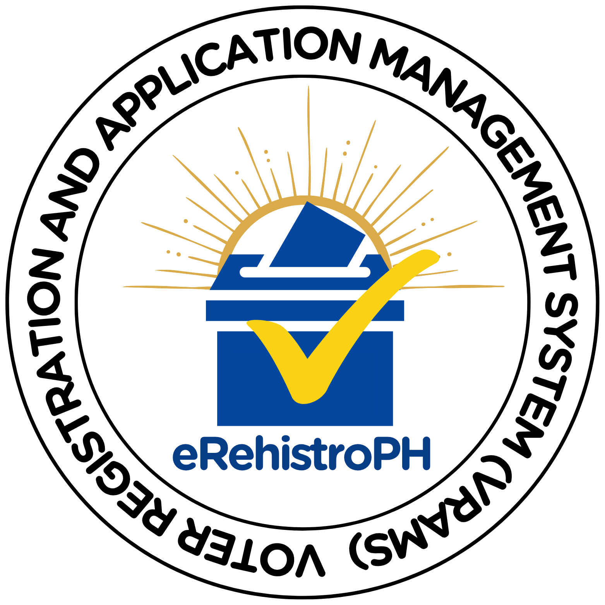

# eRehistroPH

  

  **eRehistroPH**

  

  *Register smart. Apply easy. Vote ready — with eRehistroPh.*

---

## Our Logo

The eRehistroPH logo is more than just a seal — it’s a symbol of civic duty, empowerment, and digital innovation in public service.

**The Ballot Box with the Check Mark** — At the heart of the logo is a stylized ballot box marked with a golden check. It represents every vote cast — a voice heard, a choice made. It’s the centerpiece of democracy, where every tick matters.

**The Radiating Lines** — These golden rays behind the ballot box symbolize enlightenment and hope — that with every new voter registration, we bring light to the nation’s future. It’s a reminder that progress begins with participation.

**The Bold Blue and Gold Colors** — Blue stands for integrity, trust, and the backbone of the system — the people. Gold reflects the value of your right to vote, something to be guarded, respected, and exercised with pride.

**The Circular Text** — Surrounding the image, the name "Voter Registration and Application Management System (VRAMS)" wraps around like a shield — signifying security, accessibility, and streamlined service for every eligible Filipino.

---

## About eRehistroPH

**eRehistroPH** is a secure, web-based platform designed to modernize the Philippine voter registration process. This project aims to address the inefficiencies of the traditional system and support COMELEC's goal of inclusive, fast, and accessible electoral participation.

Designed to make the voter registration process faster, more accessible, and more transparent for all Filipino citizens. Whether you’re registering for the first time, updating your records, or checking your application status, VRAMS is here to serve you — securely and efficiently.

With a user-friendly interface and status tracking features, eRehistroPH aims to minimize long queues and paperwork, help citizens avoid missed deadlines, and ensure fair, inclusive participation in elections.

**Because in a democracy, every vote counts — and every voter matters.**

---

## Project Developers

**Group 5 – BSCS 2-5**

- BOMBOLA, Yvan Raphael C.
- DELGADO, Hannahlette T.
- LAMBOHON, Ashley H.
- OJA, Ma. Izabelle L.
- SARDENIA, Reymel O.

---

## Course Information
**A Database Project for COMP 010 - Information Management**  
- Polytechnic University of the Philippines
- PUP College of Computer and Information Sciences
- Instructor: Mrs. Lydinar D. Dastas

---

  Mula sa'yo, para sa bayan

